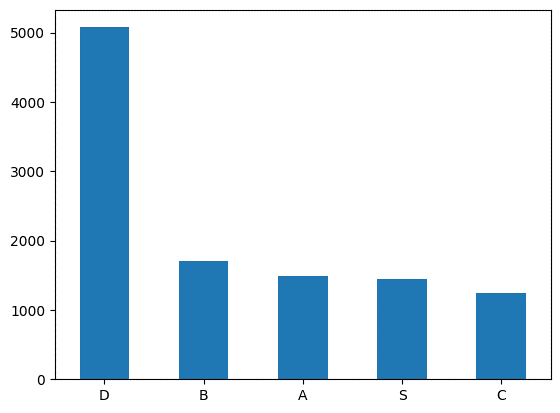

# 코멘토 직무탬프 3주차 과제

## 데이터 추출, 전처리
- 구글 빅쿼리를 활용하여 진행
```sql
SELECT *
FROM( SELECT WID, COUNT(*)login_count, MAX(level)level
FROM project.raw_login_data GROUP BY 1)
```
- WID 기준으로 그룹화를 함
- 그 후 COUNT를 이용해 로그인 횟수를 알아낸 후 가장 높은 레벨을 추출(레벨이 겹치는 문제를 방지하기 위함)
- max_level.csv


## 데이터 분석
- 레벨의 평균값이 10 정도이고, 상위 25%가 레벨 16부터 시작, 중앙값이 6
- 25이상이 S, 16 ~ 25는 A, 10 ~ 16은 B, 6 ~ 10은 C, 나머지는 D로 구간을 나눔
- 그 후 각 랭크별 수를 히스토그램을 그려 나타냄


- D 구간이 앞도적으로 높은 걸 알 수 있음

- 로그인 횟수와 레벨간의 상관계수를 구했을 땐 0.38627이 나옴
  - 양의 상관관계를 갖지만 사실상 상관이 크게 없다고 볼 수 있음